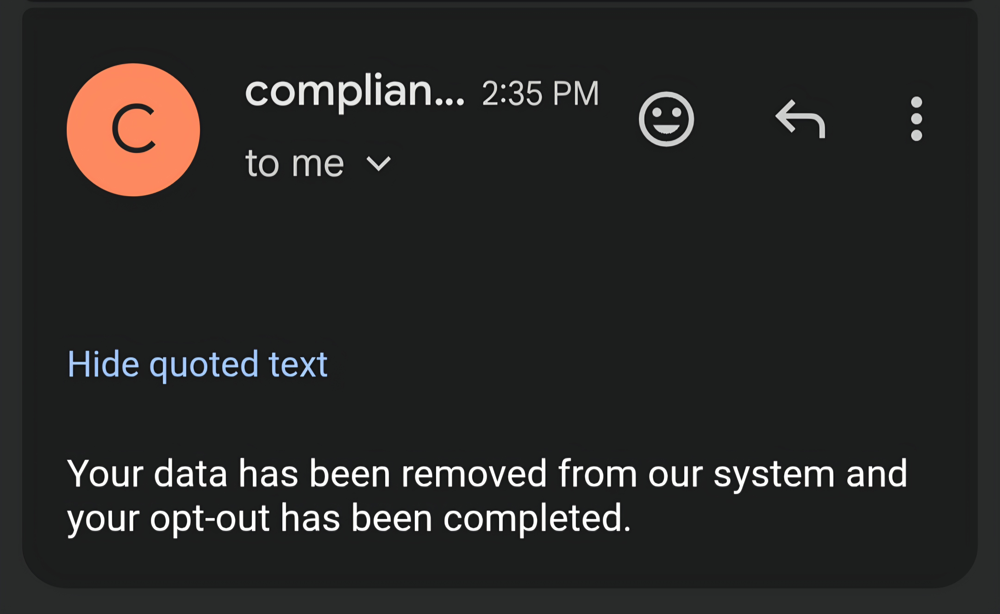

# Off The Broker 🥸
CLI tool that automates opt-out requests to data brokers via email


Requirements:
1. Ensure the latest version of python in installed in your terminal (python 3.x)
2. Create an app password for your Google account that'll be used as the value for one of your .env variables

Installation & Execution:

```bash
git clone https://github.com/RavenTheBird789/Off-The-Broker
cd Off-The-Broker
python3 -m venv env
source env/bin/activate
pip install -r requirements.txt
```

To run:

```bash
python3 broker.py
```

Optional shortcut:

```bash
alias broker="python3 broker.py"
```



Notes:
* It is highly recommended to use a burner email/Google account for the sender email input field that'll be stored in the .env text file as the value for the SENDER_EMAIL variable
* Although many data brokers may process your opt out request from an email alone, many others may send you a follow up email requiring confirmation before removing your data from their site
* It is recommended to use this tool regularly because it's not uncommon for data brokers to add your information back to their databases after a while depending on what information is collected about you from several sources
* KeyboardInturrupt (Ctrl + C) can be used to terminate the program easily within the terminal session
* A rate limit of 150 emails is implemented into the tool to prevent your email from being flagged as spam
