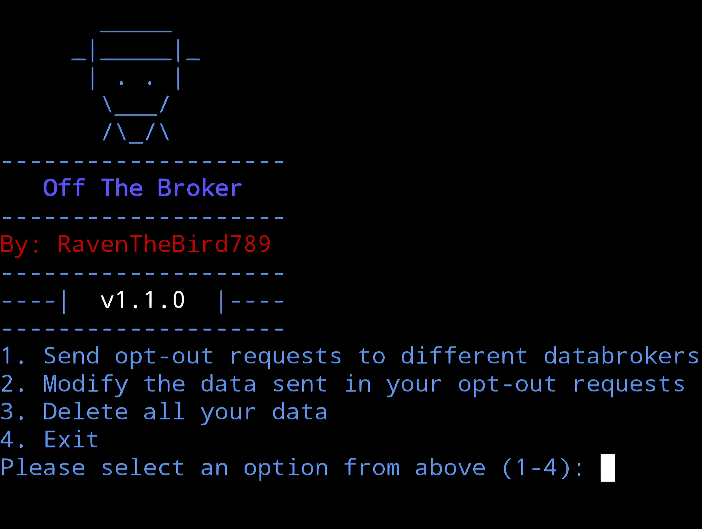

# Off-The-Broker
CLI tool that automates opt-out requests to databrokers via email

Prerequisites:
1. Ensure the latest version of python in installed in your terminal (python 3.x)
2. Ensure you have a virtual env for the required python library (If you don't, one can easily be created by executing the command "python3 -m venv env")
3. Create an app password for your Google account that'll be used as the value for one of your .env variables
